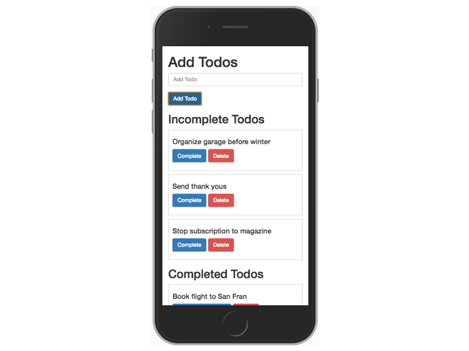

# Prime Weekend Challenge #3 - To Do App

Full Stack To Do List App  

## Built With

* jQuery
* Bootstrap
* Node.js
* Express
* PostgreSQL
## Getting Started 

Instructions to get the app running on your local machine. 

### Prerequisites

- [Node.js](https://nodejs.org/en/)
- [PostgreSQL](https://www.postgresql.org/)
### Installing

Create a PostgreSQL database for the app to interact with.

```sql
CREATE TABLE to_do_app ( 
    id SERIAL PRIMARY KEY, 
    todo VARCHAR(128) NOT NULL, 
    completed BOOLEAN NOT NULL 
);

```



## Authors

* Sam Fortin

Completed Tasks:
- [x] Input field for user to create a task. Display task on the DOM
- [x] Create table in database. id, task, completed (boolean)
- [x] GET request to the database working
- [x] Created task stored in database. POST request
- [x] After sending task to db, view should be updated with all tasks
- [x] Each task should have an option to 'Complete' or 'Delete'.
- [x] If complete is clicked, the task should indicate that it is complete PUT request
- [x] Store complete true or false in database
- [x] Delete button click removes task from database and view. DELETE request
- [x] Inlclude .sql file
- [x] Add styling
- [x] Update data-id to use hidden jQuery .data() method
- [x] Create are you sure? yes/no when deleting a task
- [x] Bring completed tasks to bottom of page, remaining tasks stay at top
- [x] Add are you sure prompt to a modal window alert

Next Steps:
- [ ] Enable editing of the tasks